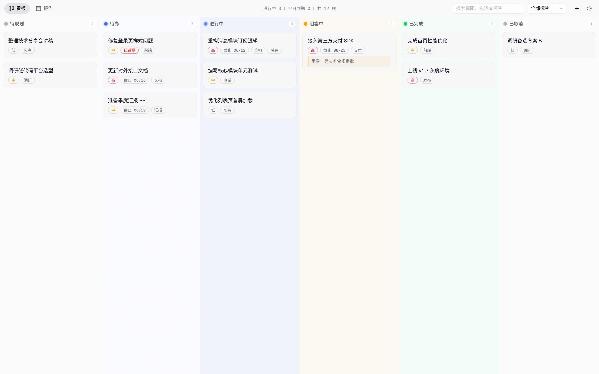
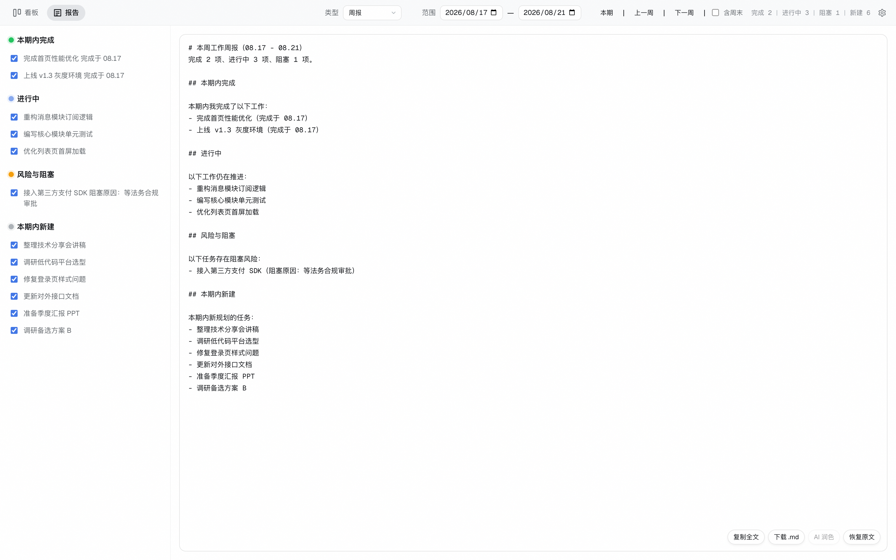

# 牛马任务看板（nmtaskboard）

专为记不住事儿的打工牛马打造的个人任务看板：记录工作待办、让 AI 帮你建任务、一键生成工作报告。界面为自主原创的极简风格（全中文、暗色优先）。数据全部保存在本机。

## 功能

- **六列任务看板**：待规划 / 待办 / 进行中 / 阻塞中 / 已完成 / 已取消，拖拽流转、列内排序；
- **任务管理**：优先级、截止日期、标签、阻塞原因；搜索与标签筛选；逾期红色「已逾期」标记；
- **AI 智能建任务**：一句话描述，AI 解析成多条结构化任务，预览确认后入库；
- **报告页（七类报告）**：日报 / 周报 / 双周报 / 月报 / 季报 / 年报 / 离职交接报告，自动从看板归纳、勾选剔除、编辑、复制、下载 Markdown；AI 润色会先学习你草稿的语气与格式习惯，只改措辞不改事实；
- **数据安全**：JSON 本地存储，支持导出 / 导入备份；旧版数据首次启动自动迁移。

## 界面截图

### 看板（暗色主题，六列拖拽流转）



### 报告页（七类报告 + 勾选剔除 + 编辑下载）



## 使用

```bash
cd nmtaskboard
npm install
npm run dev
```

打开 http://127.0.0.1:3301

- 看板 / 报告：顶部标签切换（快捷键 ⌘/Ctrl + 1/2）；
- 右上角齿轮：设置。添加提供方（默认 DeepSeek 模板，填 API Key 即用），支持多提供方与模型目录、拉取可用模型；主题切换、数据备份也在这里；
- 端口修改：`PORT=4000 npm run dev`。

## 技术栈

Node.js ≥ 18 + Express，前端原生 JavaScript / CSS（零构建）。数据以 JSON 文件保存在 `data/` 目录。

## 许可

[MIT](./LICENSE) © 2026 Joewang
